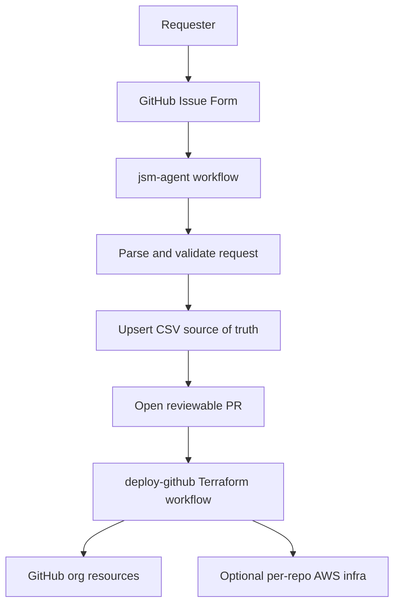

# Provisioning Dashboard

This page is the human-readable view of the CSV source of truth used by Terraform.

## Current Repository Inventory

| Repository | Visibility | Frontend | AWS IaC | NonProd AWS | Prod AWS | Budget | Jira |
| --- | --- | --- | --- | --- | --- | --- | --- |
| `my-first-test-repo` | public | true | true | nonprod-personal / 874244694062 | prod-personal / 874244694062 | BUDGET-001 |  |

## Request Intake Flow

## Agent Status Labels

- `repo-request`: Issue is eligible for the agent to process.
- `agent-processed`: Agent created a PR or confirmed the CSV files already matched the request.
- `agent-blocked`: Agent found validation errors. Fix the issue fields and remove this label before rerunning.

## CSV Ownership

- `data/repos.csv`: repository metadata, frontend flag, IaC flag, AWS account fields, budget, Jira, and portfolio.
- `data/user_repo_permissions.csv`: direct user access to repositories.
- `data/teams.csv`: GitHub teams created by Terraform.
- `data/team_repo_permissions.csv`: team access to repositories.
- `data/codeowner_rules.csv`: CODEOWNERS rules for branch protection reviews.
- `data/members.csv`, `data/team_members.csv`, and `data/branches.csv`: still managed manually in this PoC.

## Demo Script

1. Open a new issue using the `GitHub Repository Request` template.
2. Fill the form for a new repo or an update to an existing repo.
3. Run the `jsm-agent` workflow manually.
4. Review the generated PR and confirm the CSV changes.
5. Merge the PR.
6. Run `deploy-github`, review the Terraform plan, and approve apply.
