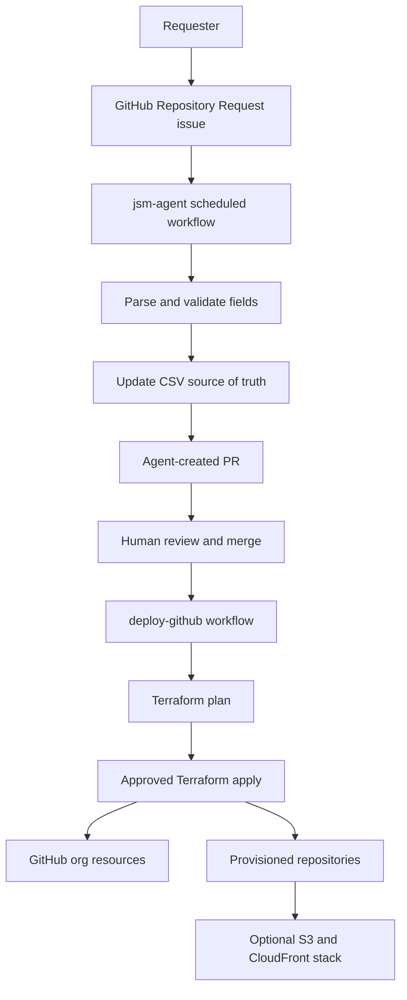

# GitHub Provisioning IaC

This repository is the source of truth for provisioning GitHub organization resources with Terraform.
It supports two layers:

- **Tier 1: GitHub organization provisioning** creates repositories, teams, members, branch protection, CODEOWNERS, repo collaborators, repo secrets, environments, and starter files.
- **Tier 2: Per-repo AWS infrastructure** injects a self-contained S3 + CloudFront Terraform stack into repositories where `iac_setup=true`.

The PoC now also includes a repository request agent that replaces manual CSV editing for common repository requests.

## Architecture

## CSV Source Of Truth

- `data/repos.csv` defines repositories and important metadata such as visibility, description, frontend flag, IaC flag, AWS accounts, budget, Jira board, and portfolio detail.
- `data/members.csv` defines organization members.
- `data/teams.csv` defines GitHub teams.
- `data/team_members.csv` defines team membership.
- `data/user_repo_permissions.csv` defines direct user access to repositories.
- `data/team_repo_permissions.csv` defines team access to repositories.
- `data/codeowner_rules.csv` defines generated CODEOWNERS entries.
- `data/branches.csv` defines extra branch protection rules beyond the default `main`, `nonprod`, and `nonprod-qa` branches.

## Repository Request Agent

The agent lives in `scripts/jsm_agent/` and runs from `.github/workflows/jsm-agent.yml`.

For the PoC, GitHub Issue Forms act as the JSM stand-in:

1. A requester opens a `GitHub Repository Request` issue.
2. The scheduled or manually triggered `jsm-agent` workflow reads open issues with the `repo-request` label.
3. The agent parses the issue form into normalized fields.
4. The agent validates required fields, repo naming, access levels, usernames, Jira URL, and AWS account format.
5. The agent upserts rows into the CSV files.
6. Multiple valid issues in one run are batched into a single PR.
7. The agent comments on each processed issue and labels it `agent-processed`.
8. Invalid issues are commented with validation errors and labeled `agent-blocked`.

This design is intentionally adapter-based. A future Jira Service Management client can replace the GitHub Issues adapter while keeping the same parser, validator, CSV manager, and PR builder flow.

## Upsert Behavior

The agent does not fail just because a repository already exists in `data/repos.csv`.
It compares the desired request fields with the current row:

- If the repo is new, it creates the row.
- If the repo already exists and fields changed, it updates the row.
- If the repo already exists and nothing changed, it skips the row.

This means a later request can safely change an existing repo from `iac_setup=false` to `iac_setup=true`.

## Running The Agent

Manual run:

1. Create a new issue using `.github/ISSUE_TEMPLATE/repo-request.yml`.
2. Go to **Actions**.
3. Run **jsm-agent**.
4. Review the generated PR.

Scheduled run:

- The workflow runs daily from the cron in `.github/workflows/jsm-agent.yml`.
- GitHub Actions permissions are configured for `contents: write`, `pull-requests: write`, and `issues: write`.

## Running Terraform Provisioning

1. Merge a PR that updates the CSV files.
2. Go to **Actions**.
3. Run **deploy-github**.
4. Review the Terraform plan.
5. Approve the gated apply job in the `admin` environment.

## Required Secrets

The `deploy-github` workflow expects these secrets:

- `APP_ID`
- `APP_PEM_FILE`
- `ORGANIZATION`
- `GH_OIDC_ROLE`
- `GH_STATE_BUCKET`
- `GH_STATE_KEY`
- `INFRA_STATE_BUCKET`
- `INFRA_OIDC_ROLE`
- `OIDC_ROLE_COMMON_NAME`
- `GH_APP_SLUG`

The `jsm-agent` workflow uses the default `GITHUB_TOKEN`.

## Demo Flow

1. Submit a request for a new repo with `iac_setup=false`.
2. Run `jsm-agent` and show the PR updating CSV files.
3. Merge the PR and run `deploy-github` to create the GitHub repo.
4. Submit a second request for the same repo with `iac_setup=true` and AWS account fields.
5. Run `jsm-agent` again and show that it updates the existing row rather than duplicating it.
6. Merge and run `deploy-github` to inject the per-repo AWS workflow and Terraform stack.

See `PROVISIONING.md` for the live PoC dashboard and demo checklist.